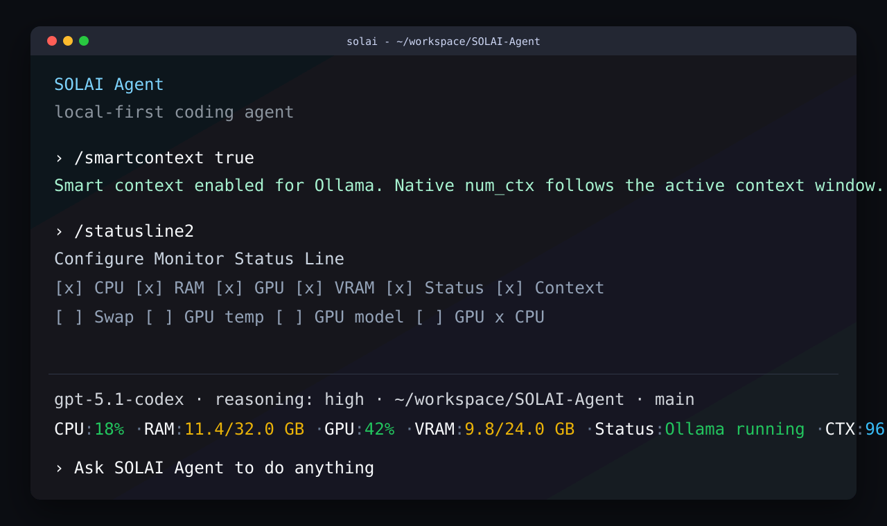

# SOLAI Coder

> 🚀 **SOLAI is currently in the Funding Phase on Pump.fun.**
> Everyone can participate and become part of the AI + DePIN ecosystem from the beginning. 🔥
> Buy $SOLAI: https://pump.fun/coin/Hy9XZ4Ae4oKtXYfuFzWkoNV18teCTpvWWu5PFD9Bpump
>
> HOLDERS of $SOLAI will be able to rent their inference power to other SOLAI Coder users and earn $SOLAI in return.

SOLAI Coder is a local-first AI agent and coding environment built around the `solai` CLI.

## SOLAI Node

SOLAI Node is the inference bridge for the SOLAI ecosystem. It connects applications
to model providers, handles routing, jobs, telemetry, pricing, and provider discovery,
and can be used in two ways:

- embedded inside SOLAI Coder for the default user experience
- installed separately for partners and external applications that only need inference

This split keeps the coder workflow simple while allowing the inference layer to grow
as an independent product.

Public progress is tracked in the [SOLAI Node Docs](https://github.com/solai-ai/solai-node-docs).

## SOLAI Protocol

The SOLAI protocol is under active development in this repository. It connects
local agents, model providers, pricing, scheduling, signed heartbeats, telemetry,
and provider discovery into a compute network for AI workloads.

The current protocol work includes:

- Provider identity with signed heartbeat payloads
- Local compute provider mode through `solai provider`
- Ollama-compatible inference routing
- Provider pricing per model in SOLAI/hour
- Availability scheduling for provider machines
- Runtime metrics for CPU, memory, GPU, model inventory, queue size and job state
- HTTP endpoints for health checks, metrics, heartbeats, jobs and chat completions
- A separate `provider/` package so the compute layer can evolve alongside the CLI

Provider commands:

```bash
solai provider enable
solai provider status
solai provider price SOLAI-20B 4
solai provider schedule --from 22:00 --to 07:00
solai provider disable
```

## Deployment model

The current repository keeps the coder and node work together so the user-facing
`solai` flow stays stable while the platform evolves.

Recommended deployment modes:

- **Embedded**: SOLAI Coder launches SOLAI Node locally and uses it through the internal SDK
- **Standalone local**: SOLAI Node is installed on its own machine and exposed through a local API
- **Standalone remote**: SOLAI Node runs in a server or container and serves partner applications

This design allows a partner to use only the Node when they need inference without
installing the full coder experience.

## Install

```bash
npm install -g @solaiecosystem/solai
```

## Local model setup

Use the built-in provider flow to point SOLAI Agent at a local model server.

1. Open `/provider_conf`
2. Enter an address such as `127.0.0.1:11434`
3. SOLAI Agent probes the endpoint, checks `/api/tags` and `/v1/models`, and stores the detected provider and model
4. Use `/model` to pick the model exposed by the server and adjust the reasoning effort for the current run

Useful commands:

```text
/provider_conf
/model
/smartcontext true
```

For Ollama-backed models, `/smartcontext true` enables native smart context sizing. SOLAI Agent
uses the active model context window to send the right `num_ctx` value to Ollama. Use
`/smartcontext false` to disable it again, or set it directly in `config.toml`:

```toml
ollama_smart_context = true
```

## Context control

SOLAI Agent keeps session history explicit and bounded.

```text
/context
/smartcontext
/mini-model
/resume-type
/new
/clear
/compact
```

- `/context` sets the maximum context window before auto-compaction
- `/smartcontext` toggles Ollama native context sizing for local models
- `/mini-model` sets the model used for context compaction
- `/resume-type` sets the compaction strategy
- `/new` opens another chat during a conversation
- `/clear` starts a fresh chat
- `/compact` trims history when the conversation gets long

## Monitor status line

Use `/statusline2` to configure a second footer line with monitor data from the local model host.
It can show CPU, RAM, swap, GPU, GPU model, VRAM, GPU temperature, Ollama runtime status, context
usage, and GPU/CPU split.

```text
/statusline2
```

You can also configure it in `config.toml`:

```toml
[tui]
status_line_2 = ["cpu", "ram", "gpu", "vram", "status", "context"]
status_line_2_use_colors = true
```

When a local provider is configured, SOLAI Agent reads monitor metrics from the provider host on
port `9898` at `/metrics`; the line stays hidden until metrics are available.



## What it includes

- Terminal workflow
- App server integration
- Python SDK
- TypeScript SDK
- Workspace-aware sandbox and approval rules

## Support

SOLAI Coder is the free local agent and coder layer for the SOLAI ecosystem.

## More

- [Repository](https://github.com/solai-ai/solai-coder)
- [SOLAI website](https://solai-ai.github.io)
